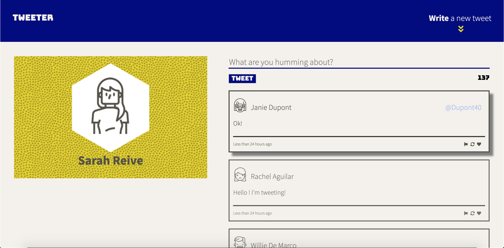
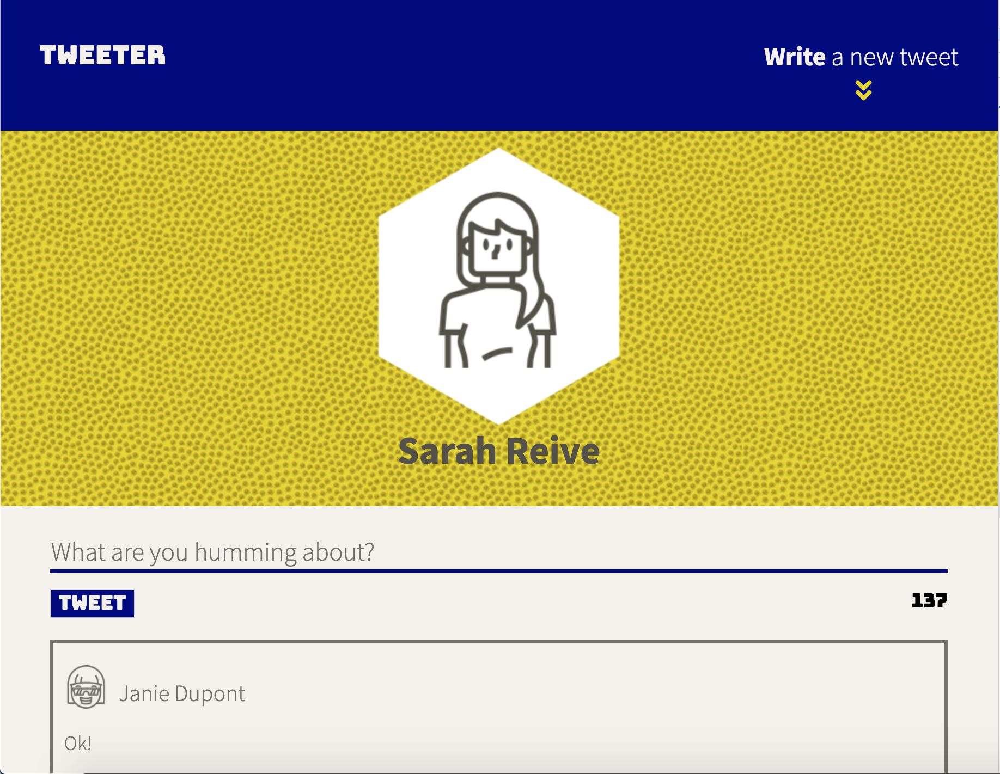
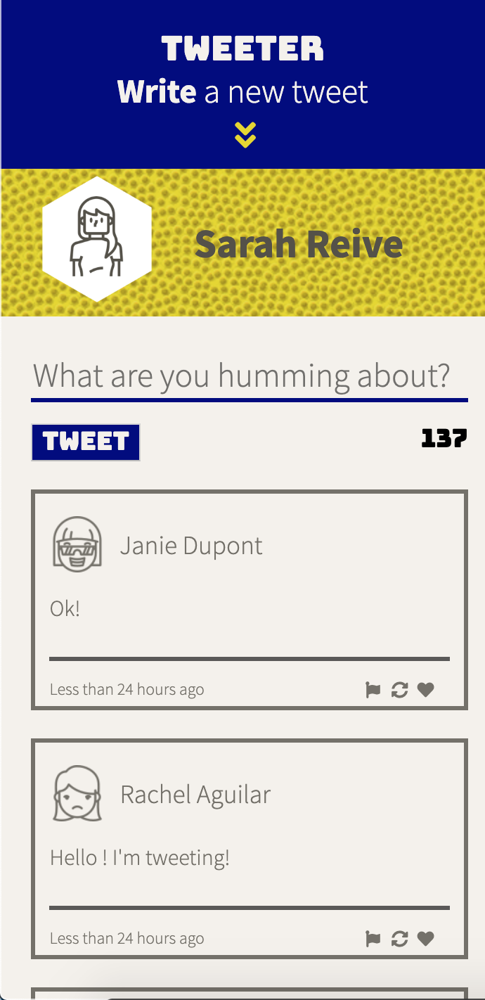

# Tweeter Project

Tweeter is a simple, single-page Twitter clone.

This repository is the starter code for the project: Students will fork and clone this repository, then build upon it to practice their HTML, CSS, JS, jQuery and AJAX front-end skills, and their Node, Express and MongoDB back-end skills.

## Getting Started

1. Fork this repository, then clone your fork of this repository.
2. Install dependencies using the `npm install` command.
3. Start the web server using the `npm run local` command. The app will be served at <http://localhost:8080/>.
4. Go to <http://localhost:8080/> in your browser.

## Dependencies

- Express
- Node 5.10.x or above
- SASS 1.22.6 or above
- md5 2.2.1 or above
- body-parser 1.19.0 or above

## Screenshots & App Demo

### Toggle effects & other animations:

### Responsive Display: 

Desktop

Tablet

Mobile

